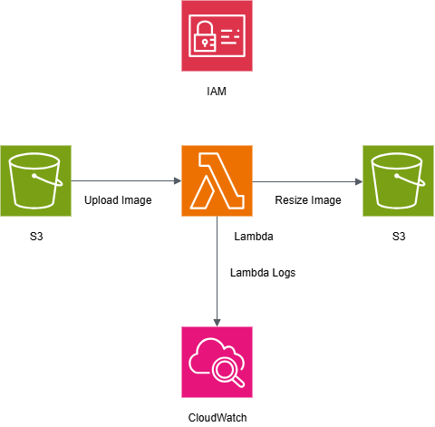

# 🖼️ AWS Lambda S3 Image Resizer (with Pillow)

This project is an AWS Lambda function that automatically resizes images uploaded to an S3 bucket using the [Pillow](https://python-pillow.org/) library. The solution is built on a cost-efficient, auto-scaling serverless architecture.

## 📜 Table of Contents
- 📌 [Solution Architecture](#-solution-architecture)

- ✨ [Features](#-features)

- ⚙️ [Requirements](#️-requirements)

- 📂 [Project Structure](#-project-structure)

- 🚀 [Deployment Steps](#-deployment-steps)

- ▶️ [Demo](#️-demo)

- 💡 [Notes & Troubleshooting](#-notes--troubleshooting)

- 💡 [Future Improvements](#-future-improvements)

## 📌 Solution Architecture

Below is the high-level architecture of the solution. An image uploaded to the input S3 bucket triggers a Lambda function. The function resizes the image using the Pillow library and saves the output to a destination S3 bucket. All function logs are sent to CloudWatch.

## ✨ Features
- Triggered automatically by a new image upload to an S3 bucket.
- Resizes images to a specified dimension (e.g., 200x200).
- Saves the resized image to a separate destination bucket or a `resized/` folder.
- Uses the Pillow library for efficient image manipulation.

## ⚙️ Requirements
- An AWS Account
- Two S3 buckets (one for input, one for output)
- AWS Lambda
- Python (match your Lambda runtime, e.g., `Python 3.12`)
- [Pillow](https://python-pillow.org/) (`~11.3.0`)
- `boto3` (`~1.34.131`)

## 📂 Project Structure

    image-resize-lambda/
        ├── lambda_function.py        # The core Lambda function code
        ├── requirements.txt          # Project dependencies (for reference)
        ├── README.md                 # Project documentation
        ├── architecture-diagram.png  # The solution architecture diagram
        └── .gitignore                # Files to be ignored by Git

## 🚀 Deployment Steps
1.  **Create an IAM Role:**
    * Create an IAM role for your Lambda function.
    * Attach a policy that grants permissions to read objects from the source S3 bucket (`s3:GetObject`) and write objects to the destination S3 bucket (`s3:PutObject`).
    * The role should also allow writing logs to CloudWatch.

2.  **Create the Lambda Function:**
    * In the AWS Lambda console, create a new function.
    * Choose your desired Python runtime (`Python 3.12`).
    * Select the IAM role you created in Step 1.
    * Upload your `lambda_function.py` code.
    * Under **Configuration** -> **Layers**, add the `PillowLayer`, To simplify deployment and manage dependencies, I utilized a publicly available Lambda Layer for Pillow, which eliminates the need to build the layer locally. The ARN for this layer is sourced from this [repository](https://github.com/keithrozario/Klayers)

3.  **Configure the S3 Trigger:**
    * In the Lambda function's console, add a trigger.
    * Select **S3** as the trigger source and choose your input S3 bucket.
    * Set the event type to **All object create events**.

4.  **Test the Solution:**
    * Upload an image (e.g., `.jpg`, `.png`) to your input S3 bucket.
    * The S3 event will trigger the Lambda function.
    * Check your destination S3 bucket for the resized version of the image. You can also review the function's logs in CloudWatch for any errors or output.

## ▶️ Demo
Watch a quick demo of the function in action. A new image is uploaded to the input S3 bucket, and the resized image is automatically generated in the destination bucket.

https://github.com/user-attachments/assets/56883088-e119-4c1f-93b2-29821916bdad

## 💡 Notes & Troubleshooting
-   **Import Errors:** If you encounter a `No module named 'PIL'` error, it means your Lambda layer is not correctly attached or is not compatible with your function's runtime or architecture. Ensure the Python versions and architectures (`x86_64` or `arm64`) for your layer and function match exactly.

## 💡 Future Improvements
-   Add support for dynamic resizing via S3 object metadata.
-   Support multiple output sizes for a single image upload.

-   Optimize image formats for web delivery to reduce file size.

